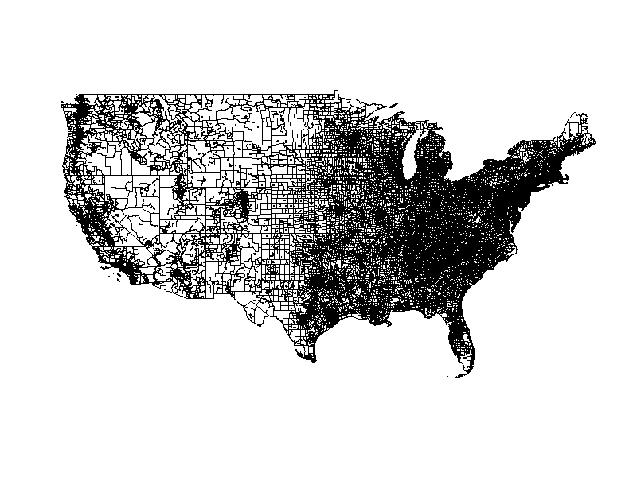
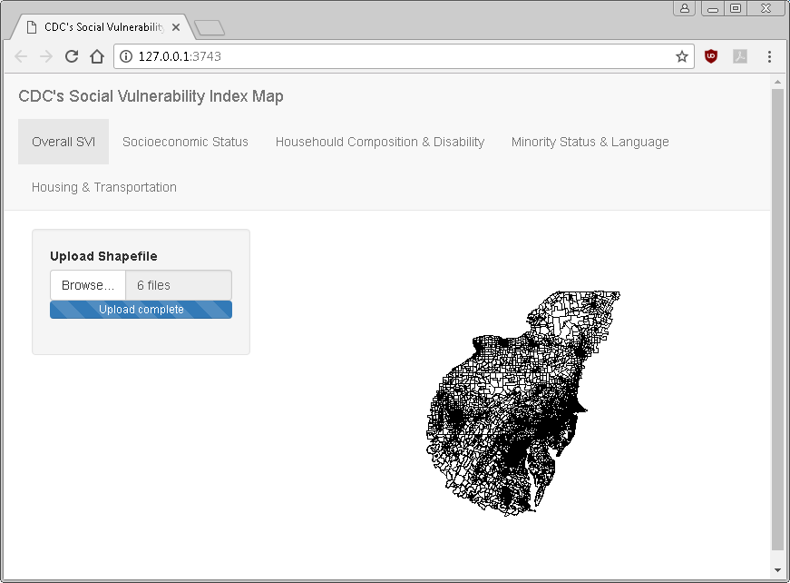

<style type="text/css">

body{ /* Normal  */
      font-size: 14px;
  }
td {  /* Table  */
  font-size: 14px;
}
h1.title {
  font-size: 38px;
  <!-- color: DarkRed; -->
}
h1 { /* Header 1 */
  font-size: 28px;
  <!-- color: DarkBlue; -->
}
h2 { /* Header 2 */
    font-size: 22px;
  <!-- color: DarkBlue; -->
}
h3 { /* Header 3 */
  font-size: 16px;
  <!-- font-family: "Times New Roman", Times, serif; -->
  <!-- color: Black; -->
}
code.r{ /* Code block */
    font-size: 14px;
}
pre { /* Code block - determines code spacing between lines */
    font-size: 14px;
}
</style>

```{r setup, include=FALSE}
knitr::opts_chunk$set(echo = TRUE, fig.align = 'center', fig.height = 4, 
                      fig.width = 5, fig.path = "images/")
knitr::opts_chunk$set(echo = TRUE)
library(raster)
library(sp)
library(rgdal)
library(rgeos)
library(knitr)
library(png)
```
<br></br>

# Summary{#summary}

<br></br>
The Social Vulnerability Index (SVI) provides a means of quantifying the relative degree of community vulnerability that stems from socio-demographic factors. Originally developed by the Agency for Toxic Substances and Disease Registry, within the Department of Health and Human Services, the SVI is calculated using variables from the U.S. Census, and American Community Survey (ACS). These variables quantify multiple types of socio-economic vulnerabilities at the national and state level in a relative way. The primary purpose of the index is identify potentially less resilient communities, in order to help inform effective policies for disaster preparation, mitigation, and recovery efforts.

<br></br>

To generate the SVI, one must conduct calculations at three tiers. Tier one is a transformation of several census/ACS variables into 15 aggregate variables. These 15 aggregate variables are then transformed into percentile ranks. In tier two, the percentile ranks of the 15 aggregate variables are combined and subsequently transformed into percentile ranks that represent “thematic domains” (Socioeconomic Status, Household Composition/Disability, Minority Status/Language, housing and transportation). Finally, tier three, the overall SVI value, is calculated by summing the percentile ranks of the four thematic domains, and subsequently transforming those values into percentile ranks. 

<br></br>

In addition, census tracts with extreme values in the SVI ranked variables were assigned variable “flags” for each index variable in the three tiers. A census tract was assigned a flag value if it ranked in the bottom or top 10% of each variable within each tier. These flags serve as a means of identifying census tracts with outstanding relative vulnerability/resilience in specific socio-demographic categories that might otherwise be overlooked when aggregated with other less/more vulnerable  socio-demographic variables. 

<br></br>

The main objective of this project is to provide a means of calculating local/regional relative SVI values. In previous implementations of the SVI, these relative values were calculated for each census tract relative to all other census tracts at both the national, and state levels. As the primary use case for the SVI is disaster and emergency preparation, mitigation, and recovery efforts, calculating SVI values only amongst those census tracts within an affected area seems pertinent. As the SVI is a relative measure, the inclusion of social vulnerability values of non-impacted areas. The web service designed in this project will allow for a user upload a geographic boundary for a defined area of interest, and view and download the results of a regional SVI calculated for the census tracts within that region. The final output will include 40 statistics for each census tract (15 census/ACS variable ranks, four thematic domain variable ranks, overall SVI rank, and the 20 corresponding flags).

Summary Section `DOL:B`

[Back to top](#summary)


<br></br>


# Approach and Method


As outlined in the [summary](#summary), the primary objective of this project is to calculate SVI at a relative scale according to user-specificed areas of interest (AOI). The calculation of SVI will be based on the CDC and ATSDR's ranking methodology below:

## Calculating the SVI:

<br></br>

1. Tier 1: 15 Census/ACS Variables
    + Rank variables from highest to lowest value (except per capita income, rank lowest to highest)
    + Calculate percentile rank for each census tract
    + Identify the top and bottom 10% of census tracts for each of the 15 variables
    + Update a flag value/variable for those tracts

<br></br>

2. Tier 2: Thematic Domains
    + Sum the percentile ranks of the 15 census/ACS variables
    + Calculate percentile rank for each census tract
    + Identify the top and bottom 10% of census tracts for each of the 4 thematic domains
    + Update a flag value/variable for those tracts

<br></br>

3. Tier 3: Overall SVI
    + Sum the percentile ranks of the 4 thematic domains
    + Calculate percentile rank for each census tract
    + Identify the top and bottom 10% of census tracts for the overall SVI
    + Update a flag value/variable for those tracts


Approach and Method Section `DOL:M`

<br></br>

[Back to top](#summary)

<br></br>

# Data and Platform

## Data

Data for this project are derived from the 2010 United States Census and the 2010 - 2014 American Community Survey 5-year estimates. The Centers for Disease Control and Prevention, in partnership with the National Center for Environmental Health; the Office of Terrorism Preparedness and Emergency Response (OTPER); and the Agency for Toxic Substances and Disease Registry's (ATSDR) Geospatial Research, Analysis, and Services Program (GRASP) developed 15 aggregate variables that they packaged within an Esri shapefile. Included in the attribute table are also margins of error for each of the 15 variables, all at the census tract level. The shapefile can be downloaded at this address: https://svi.cdc.gov/SVIDataToolsDownload.html

The figure below shows a snapshot of the shapefile used in the analysis. For the sake of clean data visualization, Alaska and Hawaii are not included in the figure below; the original dataset maintains Alaska and Hawaii attributes and geometry. 

```{r, eval = FALSE}
pg = dbDriver("PostgreSQL") #Create postgreS driver
con = dbConnect(pg, user = 'postgres', password='pschorrzan1960',
                host="localhost", port=5432, dbname="SVI") # Connect to database

usCT_noAkHi <- pgGetGeom(con, query = "SELECT * FROM svi2014_us WHERE st_abbr NOT IN ('AK', 'HI')")

png(filename = "../vignettes/usCT_noAkHi.png", width = 800, height = 600, units = "px", pointsize = 10)
plot(usCT_noAkHi)
dev.off()
```

 `DOL:M`


## PostgreSQL/PostGIS

Because the data utilized in this project contains over 72,000 unique geometries, a spatially-enabled database was implemented to maximize efficiency and speed of data analysis in RStudio. PostGIS spatial queries allowed for the selection of census tracts - and their associated indicator variables - that fall within a user-specified area of interest (i.e. an impact zone, hazard zone, etc.); this significantly decreases time of rendering and computational intensity, as only a small fraction of the 72,000+ features are loaded into memory. 

The SVI shapefile for this project was loaded into PostgreSQL and the preservation of geometries was made possible in PostGIS. The database is currently hosted locally. 

## R Packages 

This project employs numerous packages, listed below. 

1. `raster`
2. `sp`
3. `rgdal`
4. `rgeos`
5. `RPostgreSQL`
6. `rpostgis`
7. `leaflet`
8. `shiny`


Data and Platform Section `DOL:B`

[Back to top](#summary)

<br></br>


# Code

## Current Scope

**1. Create Database and add SVI shapefile** `DOL:B`

**2. Create UI for Shiny web application template** `DOL:A`

**3. Create File Upload widget UI** `DOL:A`

**4. Write File Upload server logic to accept shapefiles** `DOL:B`

**5. Perform PostGIS geometry intersection using user input shapefile and census tracts** `DOL:B`

6. Add leaflet map to UI `DOL:B`

7. Rerank and calculate SVI for census tracts in AOI `DOL:M`

8. Calculate "flags" (if any) within AOI `DOL:B`

9. Write server logic to plot census tracts and flags on leaflet map `DOL:B`

10. Create Download widget UI `DOL:M`

11. Write server logic to download SVI in AOI `DOL:B`

*Repeat Steps 6-9 for each of the thematic domains*

**Bolded items indicate completed items**

## Wishlist Items
1. Create data dashboard of vulnerable population counts for each thematic domain in AOI

2. Add interactive map features (e.g. listeners, info windows, etc.)

3. Accept different types of spatial file format inputs (e.g. geoJSON, KML, etc.) 


Section Code `DOL:A`

[Back to top](#summary)

<br></br>

# Timeline of Project

1. Pre-Assignment 6 Accomplishments
    a. Access ATSDR SVI variables [national dataset](https://svi.cdc.gov/SVIDataToolsDownload.html).
    b. Review SVI documentation, including 2011 Department of Homeland Security and Emergency Management [study](https://gis.cdc.gov/grasp/svi/A%20Social%20Vulnerability%20Index%20for%20Disaster%20Management.pdf) and post-hoc index application to Hurricane Katrina case study. 
    c. Complete set up of `PostgreSQL` database with `PostGIS` extension, and load ATSDR SVI variable data and census tract geometries.
    d. Create Shiny web application user interface, including shapefile/geometry upload widget.
    e. Integrate shapefile/geometry upload to `PostgreSQL` database, and perform intersect operation with ATSDR geometries.

2. November 20 - November 26
    a. Write logic to calculate and append percentile ranks for 15 census/ACS variables, four thematic domains, and overall SVI value.
    b. Write logic to calculate and append flags for all ranked variables.
    c. Integrate map display using `leaflet` package.
    d. Display calculated SVI values on `leaflet` map display.
    e. Determine best method to incorporate display of flag values in map interface.
    f. Create download widget to allow user to download SVI data with geometries, and in tabular form.
    
3. November 27 - December 3
    a. In class presentation - 12:00pm, 11-27-17, Jonas Clark, Rm. 103
    b. Add drop down menu to UI to allow for input/output geometry formats other than `shapefile`.
    c. Time set aside for other loose ends.

4. December 4 - December 10
    a. Explore options for hosting a publically accessible webservice (e.g. `docker`).
    b. Time set aside for other loose ends.

Section Timeline `DOL:B`

<br></br>

[Back to top](#summary)

<br></br>

# Anticipated Outcomes

## Social Vulnerability Index Calculation

1.  Fully functional RShiny interface that allows for user specification of AOI using geometry stored in multiple geospatial file formats.

2.  Automated calculation of ranked SVI values at the census tract level for user specified AOI.

3.  Multi-part graphic display of automatically generated SVI results.

4.  Downloadable SVI data in multiple formats.


## GUI for Regional SVI by User Input

The following is a screenshot of the RShiny GUI as it functioned on 11-20-2017. In this interface, one can see several things: an upload button which allows a user to input a shapefile delimiting an area of interest within which to calculate the SVI, a map area showing census tracts within the user delimited area (this will contain values for overall SVI values), and tabs to view the SVI rankings by thematic domain (yet to be implemented).

`DOL:M`

Section Anticipated Outcomes `DOL:M`

[Back to top](#summary)

<br></br>


# Note for Instructors

Note for Dr. Lyndon Estes and Zhiwen Zhu, regarding documentation of the division of labor: where appropriate, division of labor on different tasks is denoted in the following fashion: Amy = `DOL:A`, Max = `DOL:M`, Both Amy and Max = `DOL:B`

[Back to top](#summary)
